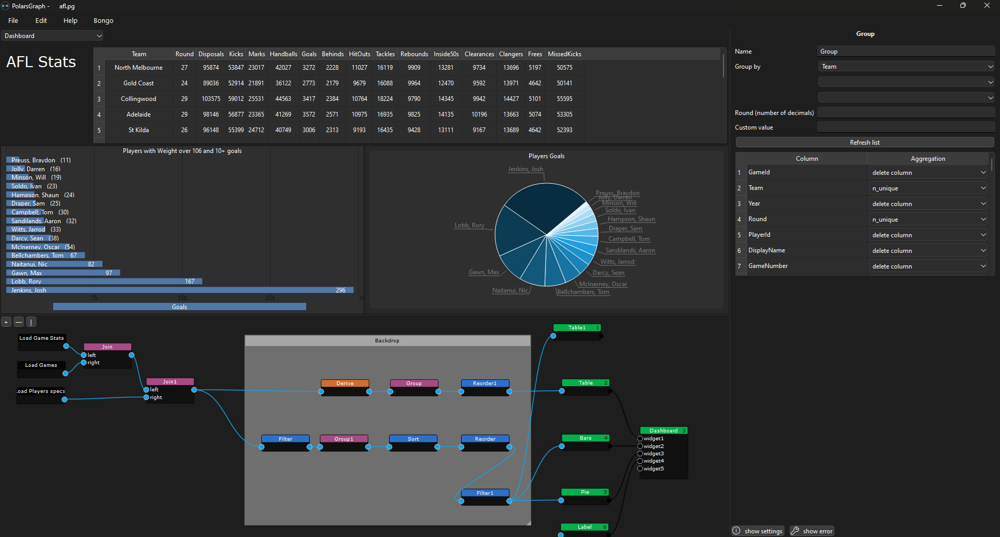

# PolarsGraph

User interface for Polars (open-source library for data manipulation).

The goal is to be able to manipulate and visualize tables easily for non-programmers.\
It's a node-based interface to:
 - Load (open)
 - Manipulate (transform, modify, ...)
 - Visualize (display)

### Stack:
- Python
- Polars
- PySide6 (Qt6)
